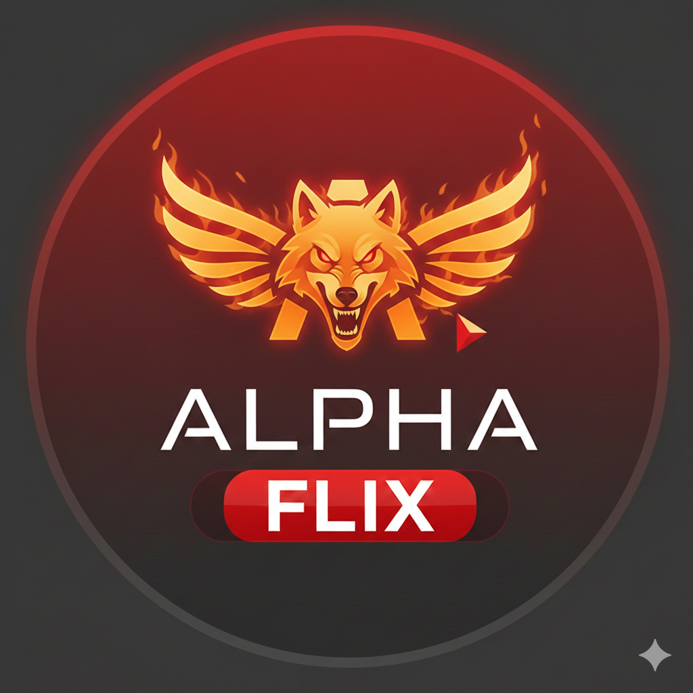

# Alpha Flix

<p align="center">
  
</p>

<p align="center">
  <strong>A premium streaming application with Real-Debrid integration</strong>
</p>

<p align="center">
  <a href="#features">Features</a> •
  <a href="#screenshots">Screenshots</a> •
  <a href="#installation">Installation</a> •
  <a href="#building">Building</a> •
  <a href="#configuration">Configuration</a> •
  <a href="#support">Support</a>
</p>

---

## Overview

Alpha Flix is a feature-rich Android streaming application that aggregates torrent sources from multiple providers and streams content through Real-Debrid for high-quality, buffer-free playback. It features a Netflix-inspired dark theme with gold accents, Fire TV compatibility, and extensive content discovery options.

## Features

### Core Streaming
- **Real-Debrid Integration** - Device pairing authentication for premium streaming
- **Multi-Source Torrent Scraping** - Aggregates from 10+ torrent providers
- **Cache Status Indicators** - Shows which torrents are instantly available on Real-Debrid
- **External Player Support** - Open streams in VLC, MX Player, or any video app

### Content Discovery
- **TMDB Integration** - High-quality posters, plots, cast info, ratings
- **Trending & Popular** - Browse what's hot right now
- **Search** - Find any movie or TV show instantly
- **Genre Categories** - Action, Comedy, Drama, Sci-Fi, and more
- **TV Show Support** - Full season and episode browsing

### Trakt.tv Integration
- **Watch History Sync** - Track what you've watched
- **Watchlist** - Save content for later
- **Continue Watching** - Resume where you left off
- **Recommendations** - Personalized suggestions based on your taste
- **Collection Management** - Organize your library

### Additional Features
- **Favorites System** - Save your favorite content locally
- **Podcasts Section** - Stream popular podcasts (Joe Rogan, Lex Fridman, Huberman Lab, etc.)
- **Live Sports** - Watch live sports events (MMA, Boxing, NBA, NFL, Soccer, F1, and more)
- **Subtitle Support** - OpenSubtitles integration for multiple languages
- **Netflix-Style Intro** - Premium app experience with animated splash screen
- **Fire TV Compatible** - Full D-pad navigation support with focus indicators

### Private Tracker Support
- **IPTorrents** - Cookie-based authentication for private tracker access
- **Stremio Addons** - Torrentio, MediaFusion, Knightcrawler, Comet, Jackettio support

## Torrent Sources

| Source | Type | Status |
|--------|------|--------|
| The Pirate Bay (Apibay) | Public | Active |
| YTS | Public (Movies) | Active |
| EZTV | Public (TV) | Active |
| 1337x | Public | Active |
| TorrentGalaxy | Public | Active |
| IPTorrents | Private | Requires Cookies |
| Torrentio | Stremio Addon | Configurable |
| MediaFusion | Stremio Addon | Configurable |
| Knightcrawler | Stremio Addon | Configurable |
| Comet | Stremio Addon | Configurable |
| Jackettio | Stremio Addon | Configurable |

## Installation

### Download APK
Download the latest APK from the [Releases](https://github.com/Zeus768/alpha-flix/releases) page.

### Requirements
- Android 6.0 (API 23) or higher
- Real-Debrid account (for streaming)
- Optional: Trakt.tv account (for sync features)

### First-Time Setup
1. Install the APK on your Android device
2. Open Alpha Flix
3. Connect your Real-Debrid account:
   - Click "Connect Real-Debrid"
   - Enter the code at [real-debrid.com/device](https://real-debrid.com/device)
   - App automatically connects when authorized
4. (Optional) Connect Trakt.tv for watch history sync

## Building

### Prerequisites
- Node.js v18+
- npm or yarn
- Expo CLI: `npm install -g expo-cli`
- EAS CLI: `npm install -g eas-cli`
- Expo account (free)

### Build Steps

1. **Clone the repository:**
   ```bash
   git clone https://github.com/Zeus768/alpha-flix.git
   cd alpha-flix
   ```

2. **Install dependencies:**
   ```bash
   npm install
   ```

3. **Login to Expo:**
   ```bash
   eas login
   ```

4. **Build APK:**
   ```bash
   eas build -p android --profile preview
   ```

5. **Download APK** from the Expo dashboard when build completes

### Local Development
```bash
npx expo start
```
Scan the QR code with Expo Go app on your phone.

### GitHub Actions (Automated Builds)
The repository includes a GitHub Actions workflow for automated builds:
1. Go to **Actions** tab
2. Click **"Run workflow"**
3. APK will be built and available on Expo dashboard

## Configuration

### Backend API
The app connects to a FastAPI backend. Update the URL in `src/services/api.js`:
```javascript
const API_BASE_URL = 'YOUR_BACKEND_URL/api';
```

### Environment Variables (Backend)
```env
TMDB_API_KEY=your_tmdb_api_key
TRAKT_CLIENT_ID=your_trakt_client_id
TRAKT_CLIENT_SECRET=your_trakt_client_secret

# Optional: Self-hosted Stremio addon URLs
TORRENTIO_URL=https://your-torrentio-instance
MEDIAFUSION_URL=https://your-mediafusion-instance
KNIGHTCRAWLER_URL=https://your-knightcrawler-instance
COMET_URL=https://your-comet-instance
JACKETTIO_URL=https://your-jackettio-instance
```

### IPTorrents Setup
1. Go to **Settings** in the app
2. Scroll to **IPTorrents** section
3. Enter your `uid` and `pass` cookies from your browser
4. Results from IPTorrents will appear in searches

## Tech Stack

### Mobile App
- **React Native** - Cross-platform mobile framework
- **Expo** - Development and build tooling
- **React Navigation** - Drawer and stack navigation
- **AsyncStorage** - Local data persistence
- **Expo SecureStore** - Secure token storage

### Backend
- **FastAPI** - High-performance Python API
- **HTTPX** - Async HTTP client
- **MongoDB** - Database (optional)

### APIs & Services
- **TMDB** - Movie and TV metadata
- **Real-Debrid** - Torrent caching and streaming
- **Trakt.tv** - Watch history and recommendations
- **OpenSubtitles** - Subtitle search

## UI/UX

### Color Scheme
| Color | Hex | Usage |
|-------|-----|-------|
| Primary Gold | `#D4AF37` | Accents, buttons, highlights |
| Background | `#050505` | Main background |
| Card | `#121212` | Content cards |
| Surface | `#18181B` | Elevated surfaces |
| Text Primary | `#E5E5E5` | Main text |
| Text Secondary | `#A1A1AA` | Muted text |
| Success | `#22C55E` | Cached/available indicators |
| Error | `#EF4444` | Errors, disconnect buttons |

### Fire TV Compatibility
- Full D-pad navigation support
- Gold focus indicators on interactive elements
- Larger touch targets for remote control
- TV-optimized layouts

## Project Structure
```
alpha-flix/
├── App.js                    # Main app entry, navigation setup
├── app.json                  # Expo configuration
├── eas.json                  # EAS build profiles
├── package.json
├── assets/
│   ├── icon.png              # App icon
│   └── splash.png            # Splash screen
├── src/
│   ├── components/
│   │   ├── ContentCard.js    # Movie/TV card component
│   │   ├── ContentRow.js     # Horizontal scroll row
│   │   ├── CustomDrawer.js   # Navigation drawer
│   │   └── TVFocusable.js    # Fire TV focus wrapper
│   ├── context/
│   │   └── AppContext.js     # Global state management
│   ├── screens/
│   │   ├── AuthScreen.js     # Real-Debrid login
│   │   ├── HomeScreen.js     # Main browse screen
│   │   ├── SearchScreen.js   # Search functionality
│   │   ├── ContentDetailScreen.js  # Movie/TV details
│   │   ├── SettingsScreen.js # Account settings
│   │   ├── FavoritesScreen.js
│   │   ├── DownloadsScreen.js
│   │   ├── CategoryScreen.js
│   │   ├── PodcastScreen.js  # Podcast episodes
│   │   ├── SportsScreen.js   # Live sports
│   │   └── SplashScreen.js   # Intro animation
│   └── services/
│       └── api.js            # API client
└── .github/
    └── workflows/
        └── build.yml         # GitHub Actions build
```

## Support Development

If you enjoy using Alpha Flix, consider supporting the development:

<p align="center">
  <a href="https://buymeacoffee.com/zeus768?new=1">
    
  </a>
</p>

## Disclaimer

This application is for educational purposes only. Users are responsible for ensuring they have the legal right to access and stream content in their jurisdiction. The developers do not host or distribute any copyrighted content.

## License

This project is provided as-is for personal use. Commercial use or redistribution is not permitted without explicit permission.

---

<p align="center">
  <strong>Developed by The Alpha</strong><br>
  <em>with AI code assistance</em>
</p>
